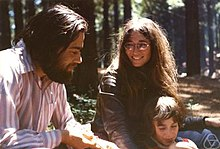

<table class="infobox biography vcard">
<tbody>
<tr>
<th colspan="2">

Manuel Blum

</th>
</tr>
<tr>
<td colspan="2">

Manuel Blum (left) with his wife&nbsp;<a title="Lenore Blum" href="https://en.wikipedia.org/wiki/Lenore_Blum">Lenore Blum</a>&nbsp;and their son&nbsp;<a title="Avrim Blum" href="https://en.wikipedia.org/wiki/Avrim_Blum">Avrim Blum</a>, 1973

</td>
</tr>
<tr>
<th scope="row">Born</th>
<td>26 April 1938&nbsp;(age&nbsp;82) 

<a title="Caracas" href="https://en.wikipedia.org/wiki/Caracas">Caracas</a>,&nbsp;<a title="Venezuela" href="https://en.wikipedia.org/wiki/Venezuela">Venezuela</a>

</td>
</tr>
<tr>
<th scope="row">Alma&nbsp;mater</th>
<td><a title="Massachusetts Institute of Technology" href="https://en.wikipedia.org/wiki/Massachusetts_Institute_of_Technology">Massachusetts Institute of Technology</a></td>
</tr>
<tr>
<th scope="row">Known&nbsp;for</th>
<td><a class="mw-redirect" title="Blum complexity axioms" href="https://en.wikipedia.org/wiki/Blum_complexity_axioms">Blum complexity axioms</a> <a title="Blum's speedup theorem" href="https://en.wikipedia.org/wiki/Blum%27s_speedup_theorem">Blum's speedup theorem</a> <a title="Blum Blum Shub" href="https://en.wikipedia.org/wiki/Blum_Blum_Shub">Blum Blum Shub</a> <a class="mw-redirect" title="Blum-Goldwasser cryptosystem" href="https://en.wikipedia.org/wiki/Blum-Goldwasser_cryptosystem">Blum-Goldwasser cryptosystem</a></td>
</tr>
<tr>
<th scope="row">Spouse(s)</th>
<td><a title="Lenore Blum" href="https://en.wikipedia.org/wiki/Lenore_Blum">Lenore Blum</a></td>
</tr>
<tr>
<th scope="row">Awards</th>
<td><a title="Turing Award" href="https://en.wikipedia.org/wiki/Turing_Award">Turing Award</a>&nbsp;<small>(1995)</small></td>
</tr>
<tr>
<td colspan="2"><strong>Scientific career</strong></td>
</tr>
<tr>
<th scope="row">Fields</th>
<td class="category"><a class="mw-redirect" title="Computer Science" href="https://en.wikipedia.org/wiki/Computer_Science">Computer Science</a></td>
</tr>
<tr>
<th scope="row">Institutions</th>
<td><a title="University of California, Berkeley" href="https://en.wikipedia.org/wiki/University_of_California,_Berkeley">University of California, Berkeley</a> <a title="Carnegie Mellon University" href="https://en.wikipedia.org/wiki/Carnegie_Mellon_University">Carnegie Mellon University</a></td>
</tr>
<tr>
<th scope="row"><a title="Thesis" href="https://en.wikipedia.org/wiki/Thesis">Thesis</a></th>
<td><a class="external text" href="http://dl.acm.org/citation.cfm?id=321395" rel="nofollow"><em>A Machine-Independent Theory of the Complexity of Recursive Functions</em></a>&nbsp;(1964)</td>
</tr>
<tr>
<th scope="row"><a title="Doctoral advisor" href="https://en.wikipedia.org/wiki/Doctoral_advisor">Doctoral advisor</a></th>
<td><a title="Marvin Minsky" href="https://en.wikipedia.org/wiki/Marvin_Minsky">Marvin Minsky</a></td>
</tr>
<tr>
<th scope="row">Doctoral students</th>
<td><a title="Leonard Adleman" href="https://en.wikipedia.org/wiki/Leonard_Adleman">Leonard Adleman</a> <a title="Dana Angluin" href="https://en.wikipedia.org/wiki/Dana_Angluin">Dana Angluin</a> <a title="Eric Bach" href="https://en.wikipedia.org/wiki/Eric_Bach">C. Eric Bach</a> <a title="Shafi Goldwasser" href="https://en.wikipedia.org/wiki/Shafi_Goldwasser">Shafi Goldwasser</a> <a title="Mor Harchol-Balter" href="https://en.wikipedia.org/wiki/Mor_Harchol-Balter">Mor Harchol-Balter</a> <a title="Russell Impagliazzo" href="https://en.wikipedia.org/wiki/Russell_Impagliazzo">Russell Impagliazzo</a> <a title="Silvio Micali" href="https://en.wikipedia.org/wiki/Silvio_Micali">Silvio Micali</a> <a class="mw-redirect" title="Gary Miller (professor)" href="https://en.wikipedia.org/wiki/Gary_Miller_(professor)">Gary Miller</a> <a title="Moni Naor" href="https://en.wikipedia.org/wiki/Moni_Naor">Moni Naor</a> <a title="Ronitt Rubinfeld" href="https://en.wikipedia.org/wiki/Ronitt_Rubinfeld">Ronitt Rubinfeld</a> <a title="Steven Rudich" href="https://en.wikipedia.org/wiki/Steven_Rudich">Steven Rudich</a> <a title="Jeffrey Shallit" href="https://en.wikipedia.org/wiki/Jeffrey_Shallit">Jeffrey Shallit</a> <a title="Michael Sipser" href="https://en.wikipedia.org/wiki/Michael_Sipser">Michael Sipser</a> <a title="Umesh Vazirani" href="https://en.wikipedia.org/wiki/Umesh_Vazirani">Umesh Vazirani</a> <a title="Vijay Vazirani" href="https://en.wikipedia.org/wiki/Vijay_Vazirani">Vijay Vazirani</a> <a title="Luis von Ahn" href="https://en.wikipedia.org/wiki/Luis_von_Ahn">Luis von Ahn</a> <a title="Ryan Williams (computer scientist)" href="https://en.wikipedia.org/wiki/Ryan_Williams_(computer_scientist)">Ryan Williams</a></td>
</tr>
<tr>
<th scope="row">Website</th>
<td><a class="external text" href="https://www.cs.cmu.edu/~mblum" rel="nofollow">www<wbr />.cs<wbr />.cmu<wbr />.edu<wbr />/~mblum</a></td>
</tr>
</tbody>
</table>
 

<strong>Manuel Blum</strong>&nbsp;(born 26 April 1938) is a Venezuelan-American&nbsp;<a title="Computer scientist" href="https://en.wikipedia.org/wiki/Computer_scientist">computer scientist</a>&nbsp;who received the&nbsp;<a title="Turing Award" href="https://en.wikipedia.org/wiki/Turing_Award">Turing Award</a>&nbsp;in 1995 "In recognition of his contributions to the foundations of&nbsp;<a title="Computational complexity theory" href="https://en.wikipedia.org/wiki/Computational_complexity_theory">computational complexity theory</a>&nbsp;and its application to&nbsp;<a title="Cryptography" href="https://en.wikipedia.org/wiki/Cryptography">cryptography</a>&nbsp;and program checking".

 

<h2> Publications </h2>

<ul>

 <li><a target="_blank" href="https://github.com/manjunath5496/Manuel-Blum-Publications/blob/master/blum(1).pdf" style="text-decoration:none;">Naturally Rehearsing Passwords</a></li>

 <li><a target="_blank" href="https://github.com/manjunath5496/Manuel-Blum-Publications/blob/master/blum(2).pdf" style="text-decoration:none;">CAPTCHA:
Using Hard AI Problems For Security</a></li>

<li><a target="_blank" href="https://github.com/manjunath5496/Manuel-Blum-Publications/blob/master/blum(3).pdf" style="text-decoration:none;">Coin Flipping by Telephone</a></li>
 <li><a target="_blank" href="https://github.com/manjunath5496/Manuel-Blum-Publications/blob/master/blum(4).pdf" style="text-decoration:none;">Secure Human Identification Protocols</a></li>                              
<li><a target="_blank" href="https://github.com/manjunath5496/Manuel-Blum-Publications/blob/master/blum(5).pdf" style="text-decoration:none;">An Efficient Probabilistic Public-Key Encryption Scheme Which Hides All Partial Information</a></li>
<li><a target="_blank" href="https://github.com/manjunath5496/Manuel-Blum-Publications/blob/master/blum(6).pdf" style="text-decoration:none;">Comparison of Two Pseudo-Random Number Generators</a></li>

</ul>
